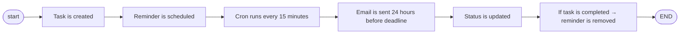

# 📝 Notes App – Smart Task Management Platform
<p align="center">

</p> <p align="center"> <a href="https://notesapp-rust-rho.vercel.app" target="_blank">  </a> </p>

**<p align="center">  </p>**

A modern full-stack task management application that helps users organize their lives with deadlines and automated email reminders.

This project includes:

* 🌐 **Frontend** – Built with Next.js (App Router), TypeScript, Tailwind CSS
* ⚙️ **Backend API** – Node.js, Express 5, TypeScript, MongoDB
* 📧 **Automated Email Reminder System** (24 hours before deadline)

---

## ✨ Features

### 🔐 Authentication

* User registration & login
* JWT-based secure authentication
* Protected task routes

### ✅ Task Management

* Create tasks with title, description & deadline
* Edit & update tasks
* Mark tasks as completed
* Delete tasks
* Filter tasks (completed / incomplete)

### ⏰ Smart Email Reminders

* Automatic reminder scheduling when a task is created
* Reminder sent **24 hours before deadline** (configurable)
* Cron job runs every 15 minutes
* Reminder auto-cleanup when task is completed

### 🛡 Security & Reliability

* Password hashing with bcrypt
* Helmet.js security headers
* Input validation (express-validator + Zod)
* Structured error handling
* CORS configuration
* Production-ready architecture

---

# 🏗️ Architecture Overview

```
notesapp/
├── backend/        # Node.js + Express + MongoDB API
└── frontend/       # Next.js 15 App Router (Deployed on Vercel)
```

---

# 🎨 Frontend

### Tech Stack

* Next.js (App Router)
* TypeScript
* Tailwind CSS
* Zustand (state management)
* Axios (API calls)
* Deployed on Vercel

### UI Features

* Clean hero landing page
* Login & registration flow
* Task dashboard
* Deadline tracking
* Responsive layout

### Frontend Setup

```bash
cd frontend
pnpm install
pnpm dev
```

### Frontend Environment Variables (`frontend/.env`)

```env
NEXT_PUBLIC_API_URL=http://localhost:3001/api
```

---

# ⚙️ Backend – Task Management API

A robust task management backend built with Node.js, Express, TypeScript, and MongoDB.

---

## 🚀 Backend Features

* JWT Authentication
* CRUD Task Management
* Automatic Reminder Scheduling
* Cron-based Email Processing
* Secure Password Hashing
* Modular Architecture
* Production-ready structure

---

## 🛠 Backend Tech Stack

* Node.js
* Express.js 5.x
* TypeScript
* MongoDB + Mongoose
* JWT
* bcryptjs
* Nodemailer
* node-cron
* Helmet.js
* express-validator
* Zod
* Morgan
* pnpm

---

## 📁 Backend Project Structure

```
backend/src/
│
├── api/
│   ├── auth/
│   ├── tasks/
│   └── reminder/
│
├── config/
├── jobs/
├── middlewares/
├── models/
├── utils/
│
├── routes.ts
├── app.ts
└── server.ts
```

---

# 🔧 Backend Setup

## 1️⃣ Install Dependencies

```bash
cd backend
pnpm install
```

## 2️⃣ Environment Variables

Create:

* `.env.development`
* `.env.production`

Example:

```env
NODE_ENV=development
PORT=3001
MONGODB_URI=mongodb://localhost:27017/notesapp_platform

JWT_SECRET=your-super-secret-jwt-key
JWT_SECRET_EXPIRATION=1h

CORS_PATH=http://localhost:3000

REMINDER_HOURS_BEFORE=24

EMAIL_HOST=smtp.gmail.com
EMAIL_PORT=587
EMAIL_USER=your-email@gmail.com
EMAIL_PASSWORD=your-app-password
EMAIL_FROM=noreply@notesapp.com

FRONTEND_URL=http://localhost:3000
```

## 4️⃣ Run Backend

Development:

```bash
pnpm dev
```

Production:

```bash
pnpm build
pnpm start:prod
```


# 📧 Reminder System Flow




---

# 🛡 Security Features

* bcrypt password hashing
* JWT authentication
* Helmet security headers
* CORS configuration
* Input validation
* Structured error responses

---

# 📄 License
